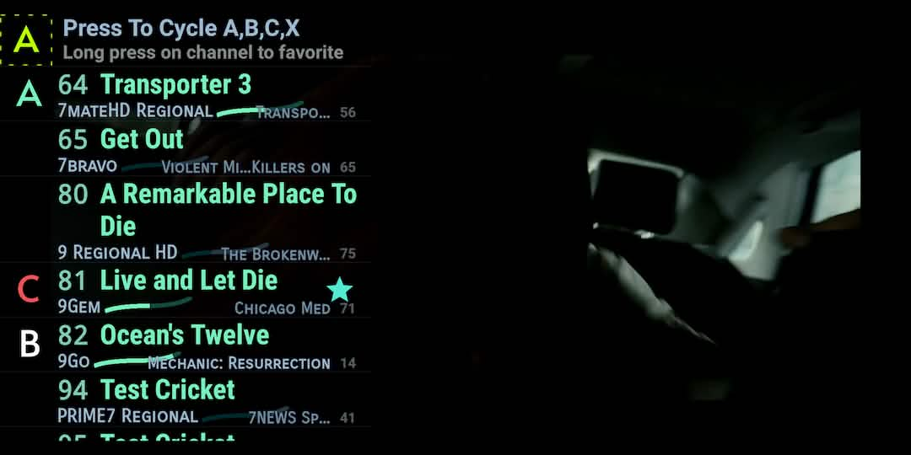
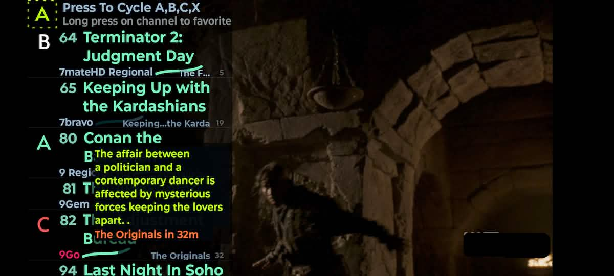
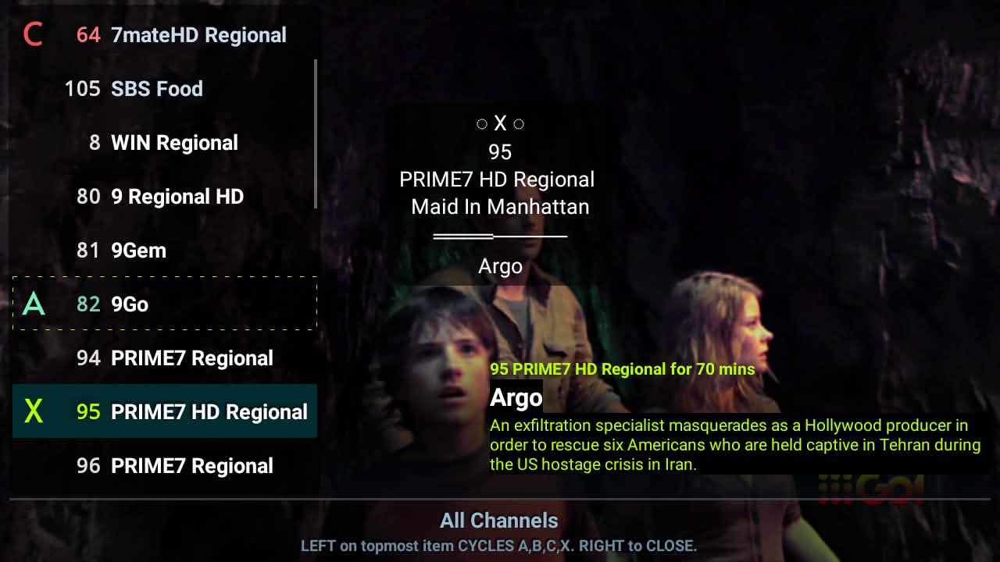
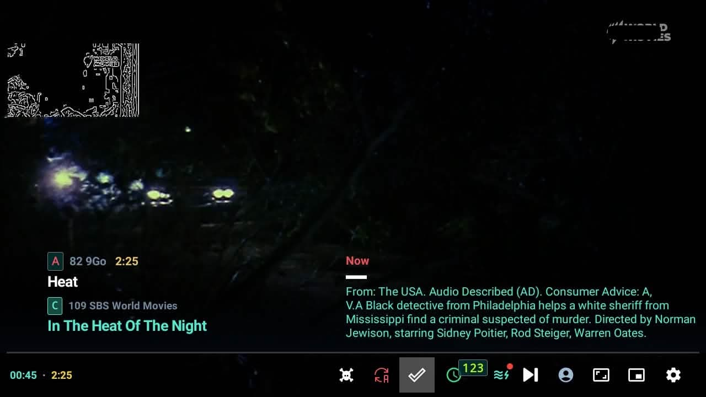

  <picture>
   <source media="(prefers-color-scheme: dark)" srcset="./screenshots/other/andr_dark.png" width="462px" alt="RelaxoPlayer for Android" />
   
 </picture>

<h3 align="center">Adblock Live TV with the best IPTV player</h3>

  Block every adbreak and walk away refreshed. 

  
  

    <a href="https://relaxoplayer.com/">Website</a> |
    <a href="#socials">Socials</a>
      
    <a href="https://github.com/relaxo-player/RelaxoPlayer-Android/releases">
        " />
    </a>
<!--      -->

    

* [Project Idea](#the-idea)
  * [Features](#features)
  * [How it works](#tech-info)
* [File an issue](#general-info)

> #### Disclaimer
>   - This is not an open source project. However, see [roadmap](https://github.com/relaxo-player/RelaxoPlayer-Android/milestones) for open-source features.
>   - This app does not contain any IPTV streams.

Relaxo Player is an IPTV video player for Android. It can block TV ads and other annoyances automatically, even while unattended, so you get continuous background noise bliss from any LIVE stream. 

 

To get started add your M3U playlist or use as external video player. For more info and to download Relaxo Player for Android, visit our website https://relaxoplayer.com/.

|  |   |
| ----------------------------------------------------------- | --------------------------------------------------------------- |

#### TV-

|  |  |
| ----------------------------------------------------------- | --------------------------------------------------------------- |

## 💡 Project Idea 

Loud repeative ads make us feel groggy.

You should be able to leave your TV on 24/7 and walk away refreshed. 

We put ⌞ **ADBLOCK** ⌝  `INSIDE THE TV` and gave users a way to choose what plays instead of ads, we then added **CONTENT-AWARE TIMERS** to make the evening TV ritual a serene experiece.

## ☠️ Killer Features 

  - **Auto Adblock** switches away from ads
  - **Manual adblock and interventions** just in case
  - **We 🤜 bump you away from all undesirable shows**
  - ⩇⩇:⩇⩇ **Smart timers** jolt you to your next show
  - **InstaMute**  `SWIPE RIGHT` to temporarily mute annoying sounds
  - **Inkblot-out the logo** inks over broadcast logos for total emersion

> [!WARNING]
>
> Endless adfree TV can become addictive

### How It Works

-  The Adblock works by latching onto the Live broadcast logo continuously
-  Double tap the screen at any time to kill ads instantly

### General Info
-  You can find all the releases in the [releases](https://github.com/relaxo-player/RelaxoPlayer-Android/releases/latest)
 section.

-  Create issues and give suggestions or feedback here

-  Crowd-sourced translate of strings.xml file into your language is welcome

> [!NOTE]
>
> Currently in open beta.

Stay updated on big releases via the [newsletter](https://relaxoplayer.com/newsletter/subscribe). Support and [contact](https://relaxoplayer.com/contact) via website, email.

