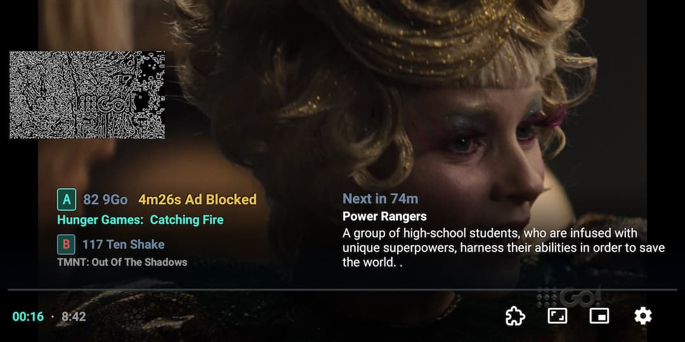
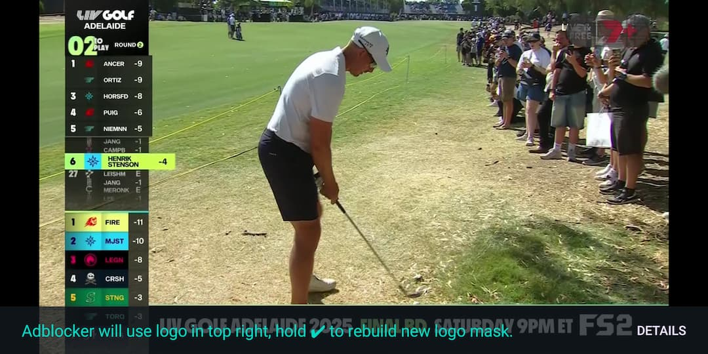

  <picture>
   <source media="(prefers-color-scheme: dark)" srcset="./screenshots/other/andr_dark.png" width="300px" alt="RelaxoPlayer for Android" />
   
 </picture>

<h3 align="center">Adblock Live TV with the best new IPTV player</h3>

  Block every ad-break and walk away refreshed.

  
  

    <a href="https://relaxoplayer.com/">Website</a> |
    <a href="#socials">Socials</a>
      
    <a href="https://github.com/relaxo-player/RelaxoPlayer-Android/releases">
        " />
    </a>
<!--      -->

    

<!-- * [Project Idea](#the-idea)
  * [Features](#features)
  * [How it works](#tech-info)
* [File an issue](#general-info)
However, see [roadmap](https://github.com/relaxo-player/RelaxoPlayer-Android/milestones) for open-source features. -->
> #### Disclaimer
>   - This is not an open source project. 
>   - This app does not contain any IPTV streams.

Relaxo Player is an IPTV video player app for Android with built-in adblocker. Just watch as normal and it blocks TV ads by automatically switching the live feed away or auto muting when the broadcast logo disappears. 

The app is lightweight and uses simple inutitive [controls](#controls) like most standard video players with a few enhancements for adblock.

 

|[Coming soon to PlayStore, sideloading required for now](https://relaxoplayer.com/newsletter/subscribe?launch=true)|
|---|

To get started add your .M3U playlist with EPG.xml URL for guide data, or simply use as external video player from an existing IPTV app installed. For more info and to download Relaxo Player for Android, visit our website https://relaxoplayer.com/.

#### Phone-

|  |   |
| ----------------------------------------------------------- | --------------------------------------------------------------- |

#### TV-

|  |  |
| ----------------------------------------------------------- | --------------------------------------------------------------- |

More Screenshots

  
|  |  |
| ----------------------------------------------------------- | --------------------------------------------------------------- |

## 💡 Project Idea 

Loud repetitive ads suck. You should be able to leave your TV on 24/7 and walk away refreshed.

Legacy IPTV players are slow, clunky, and refuse to innovate on UI or add power features for extended watch sessions. 

We put ⌞ **ADBLOCK** ⌝  `INSIDE THE TV` and gave users a way to choose what plays instead of ads, we then added **CONTENT-AWARE TIMERS** to make the evening TV ritual a serene experience.

## ☠️ Killer Features 

  - **Auto Adblock** switches away from ads
  - **Manual adblock** at any time
      - Double tap the screen or press OK to start, if needed `SWIPE RIGHT` to extend timeout
      - Backpress returns playback to primary stream with sound to normal levels 
  - **We 🤜 bump you away from any undesirable shows** that you've set
  - ⩇⩇:⩇⩇ **Smart timers** jolt you to your next show
  - ⩇⩇:⩇⩇ **Sleep timers** lets you watch in bed (or show a black screen until your next show starts!)
  - ⩇⩇:⩇⩇ **Inactivity timer** preserves battery
  - **InstaMute**  `SWIPE RIGHT` to temporarily mute annoying sounds +15 seconds
  - **Inkblot-out the logo** inks over broadcast logos for total immersion
  - **Fast & Transparent Menus** allows you to keep watching and check what's on
  - **Powerful Settings** detects hardware trouble with codecs, auto retry or downgrade to software rendering

> [!WARNING]
>
> Endless adfree TV can become addictive

### How It Works

-  The Adblock works by latching onto the Live broadcast logo continuously and switches streams when not present
-  `Double tap the screen` at any time to kill ads instantly *i.e. temporarily fallback channel from A -> B -> C*
    - It helps to imagine the player has a stack of your last 3 channels: A | B | C with 'A' being the topmost current primary channel - we simply switch you down the stack when ads occur and return to primary when you press back.
      
### Controls

-  Basic UI like VLC, Just (video) Player, etc. with screen surface controls:
    - `Swipe up/down` on left side or right side for brightness & volume respectively
-  Adblock centric IPTV Layout
    - `Swipe left` on the playing surface to **open channels menu** where you choose what to watch and easily switch between adblock modes (mute only | fallback mode)
    - `Swipe down` from centre to see a list of **upcoming programmes** on your current selected channels to set a timer for.
    - User volume changes / backpresses are always paramount and escape any adblock mute event.

|[Full User Guide](https://relaxoplayer.com/docs)|
|---|

---

### General Info
-  You can find all the releases in the [releases](https://github.com/relaxo-player/RelaxoPlayer-Android/releases/latest)
 section

-  Create issues and give suggestions or feedback here

-  Crowd-sourced translate of strings.xml file into your language is welcome

> [!NOTE]
>
> Currently in open beta, no signup required.

Stay updated on big releases via the [newsletter](https://relaxoplayer.com/newsletter/subscribe). Support and [contact](https://relaxoplayer.com/contact) via website, email.

